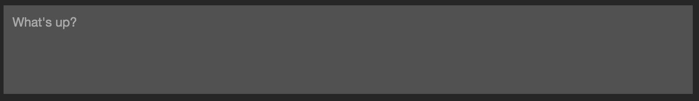

# Meteor Chat - Styleguide

This is just a helpful guide of how to structure the style your app.
You are, of course, free to style the application the way you choose.

You can grab the CSS [here](chat-app.css).

## Base structure


```html
<div class="app-container">
    <header class="header"><!-- Your title or logo can go here --></header>

    <section class="content-container">

        <section class="message-container">

            <section class="messages">
                <!-- Add messeges in this section -->
            </section>

            <section class="post">
                <!-- Put your textarea/input here -->
            </section>

        </section>

        <section class="users">
            <!-- Show users here -->
        </section>

    </section>
</div>
```

### Logo


```html
<a href="#" class="logo"></a>
```

## Post - Input



```html
<textarea name="post" placeholder="What's up?"></textarea>
```

## Messages

### Message


```html
<div class="message">
    <div class="content">
        <div class="author">Barack Obama</div>
        <div class="text">This app is cool!</div>
        <div class="time">20/1/2009</div>
    </div>
</div>
```

### Message - Current user


```html
<div class="message -current">
    <div class="content">
        <div class="author">Donald Trump</div>
        <div class="text">I also enjoy it very much!</div>
        <div class="time">12/12/2014</div>
    </div>
</div>
```

## Users

### User - Active


```html
<div class="user">
    <div class="status -active"></div>
    <div class="name">Barack Obama</div>
</div>
```

### User - Inactive


```html
<div class="user">
    <div class="status -inactive"></div>
    <div class="name">Barack Obama</div>
</div>
```

### User - Current user


```html
<div class="user -current">
    <div class="status -active"></div>
    <div class="name">Donald Trump</div>
</div>
```